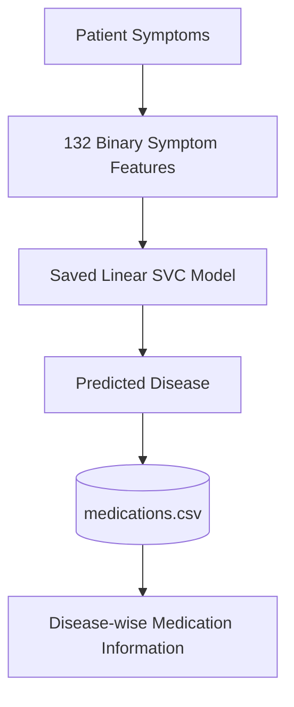
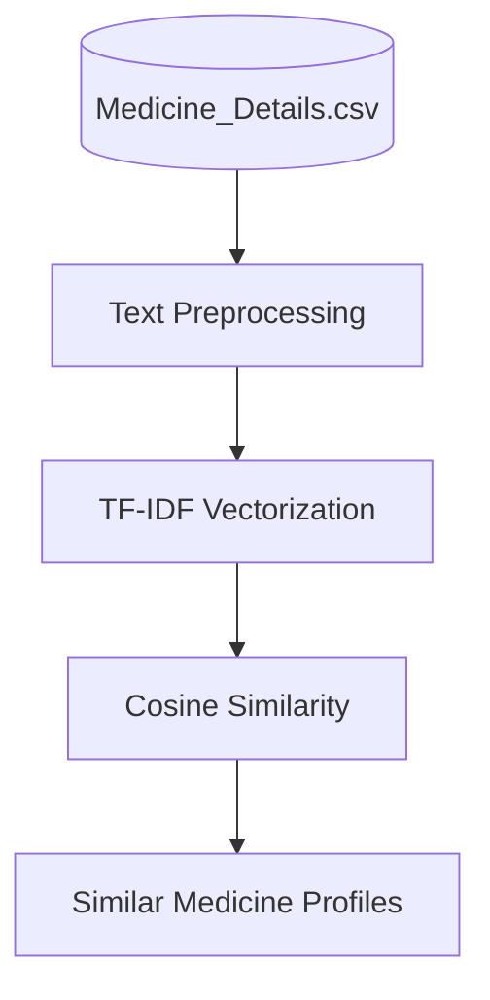
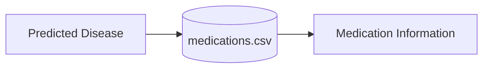
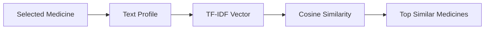

<div align="center">

# 🩺 MediAI

### Personalized Healthcare & Medicine Recommendation System

*Symptom-based disease prediction, disease-wise medication information, and content-based medicine similarity in one interactive Streamlit dashboard.*


</div>

> [!WARNING]
> **Educational prototype only.** MediAI does not provide medical diagnosis, prescribe medication, or replace advice from a qualified healthcare professional. See the [Disclaimer](#-disclaimer).

---

## 🚀 Live Demo

🌐 **Try the app:** `<https://personalized-healthcare-recommendation-system-e2fpxt8bw8scbjh4.streamlit.app/`>


---

## 📖 Overview

**MediAI** is an educational and informational machine learning application that combines disease prediction, disease-wise medication information, patient-profile analysis support, and content-based medicine similarity into a single Streamlit dashboard.

The system allows a user to:

- Select symptoms from the 132 symptom features used by the trained disease model.
- Predict a disease using a saved Linear SVC model.
- View disease-wise medication information from the provided medication dataset.
- Explore similar medicine profiles using TF-IDF and cosine similarity.
- Understand the datasets, machine learning pipeline, and project limitations through an interactive dashboard.

---

## 🎯 Project Objectives

1. Build a machine learning model for disease prediction from symptom features.
2. Connect predicted diseases with disease-wise medication information.
3. Develop a content-based medicine similarity system.
4. Build an interactive Streamlit dashboard around the developed ML components.
5. Demonstrate the complete workflow from data preprocessing to deployment.
6. Clearly document limitations and data-quality issues in the provided datasets.

---

## 🧠 System Architecture

### Disease Prediction Pipeline



### Medicine Similarity Pipeline



---

## 📊 Dataset Information

The project uses four datasets, each with a separate role.

| Dataset | Purpose | Records |
|---|---|---:|
| `Training.csv` | Disease prediction from symptoms | 4,920 |
| `medications.csv` | Disease-wise medication information | 41 |
| `Cleaned_Dataset.csv` | Patient-profile / risk-analysis support | 349 |
| `Medicine_Details.csv` | Medicine-level text similarity | 11,825 |

<details>
<summary><b>Dataset details</b></summary>

### `Training.csv`
- 4,920 records, 132 binary symptom features (`0` / `1`)
- Target column: `prognosis` (41 disease classes)
- The saved disease prediction model uses the same 132 symptom features

### `medications.csv`
- Disease-wise medication information, retrieved after disease prediction
- Contains **no** patient-level medication outcomes or dosage information, so the application does not learn or prescribe an optimal medication for an individual

### `Cleaned_Dataset.csv`
- Patient-profile and risk-related fields: age, gender, blood pressure, cholesterol level, disease, risk level, outcome variable
- Used only as supporting patient-profile / risk-analysis data
- **Not merged** with `Training.csv`, because the records do not represent the same patient-level observations

### `Medicine_Details.csv`
- Medicine name, composition, uses, side effects, manufacturer, review percentages, image URL
- Similarity uses only: **Medicine Name, Composition, Uses, Side effects**
- Review percentages are not used to determine medical effectiveness or to rank medicines

</details>

---

## 🤖 Machine Learning

### Disease Prediction

| Item | Value |
|---|---|
| Algorithm | Linear Support Vector Classifier (Linear SVC) |
| Input | 132 binary symptom features |
| Output | 1 of 41 disease classes |
| Model artifact | `models/best_model.pkl` |
| Label decoder | `models/disease_encoder.pkl` (`LabelEncoder`) |
| Persistence | Joblib |

### Model Evaluation

On the provided dataset and evaluation setup:

- **Test accuracy:** 100%
- **Precision / Recall / F1:** 1.00 across the evaluated classes

> [!IMPORTANT]
> These results should **not** be interpreted as real-world diagnostic accuracy. `Training.csv` contains 4,920 rows but only **304 unique rows** after removing exact duplicates. Identical records can appear in both training and test splits, which inflates the measured performance. The figures reflect performance on the provided dataset and split, not clinical diagnostic performance.

---

## 💊 Medication Information

After disease prediction, the application looks up the predicted disease in `medications.csv` and displays the medication information available for it.



The system does **not**:

- Prescribe medication
- Provide dosage instructions
- Determine an optimal medicine
- Use patient-level treatment outcomes
- Replace professional medical advice

---

## 🔎 Medicine Similarity

The medicine similarity component uses a **content-based filtering** approach.

The text fields **Medicine Name, Composition, Uses, and Side effects** are combined, converted to numerical vectors with **TF-IDF**, and compared with **cosine similarity**.



A higher score indicates greater **textual similarity** between medicine records. It does **not** mean:

- Clinical equivalence
- Equal effectiveness
- Equal safety
- Interchangeability
- Suitability for a particular patient

---

## 🖥️ Streamlit Dashboard

The final application is built with **Streamlit** and custom CSS.

| Page | What it provides |
|---|---|
| 🏠 **Diagnosis** | Patient profile fields, searchable symptom selection (132 features), selected-symptom counter, disease prediction, model confidence, top model probabilities, patient profile summary, disease-wise medication information, medical disclaimer |
| 💊 **Medicine Similarity** | Medicine selection, number of similar medicines, textual similarity scores, composition, uses, side effects |
| 📊 **Project Overview** | System architecture, dataset roles, number of disease classes, symptom features, medicine records, ML components, data-quality observations, limitations |
| ℹ️ **About** | Project objective, disease prediction, medication information, medicine similarity, technologies, educational purpose and limitations |

---

## 📸 Dashboard Preview

<!-- Add screenshots to docs/images/ and update the file names below -->

### Diagnosis


### Medicine Similarity


### Project Overview


---

## 🛠️ Technologies

| Category | Tools |
|---|---|
| Programming language | Python |
| Data analysis | Pandas, NumPy |
| Machine learning | Scikit-learn, Support Vector Classifier (Linear SVC), LabelEncoder |
| Medicine similarity | TF-IDF Vectorizer, Cosine Similarity |
| Model persistence | Joblib |
| Dashboard | Streamlit, Custom CSS |
| Development | Jupyter Notebook, VS Code, Git, GitHub |

---

## 📁 Project Structure

```text
personalized-healthcare-recommendation-system/
│
├── data/
│   ├── Training.csv
│   ├── Cleaned_Dataset.csv
│   ├── medications.csv
│   └── Medicine_Details.csv
│
├── models/
│   ├── best_model.pkl
│   └── disease_encoder.pkl
│
├── notebook/
│   ├── 01_Data_Inspection.ipynb
│   ├── 02_Disease_Prediction.ipynb
│   ├── 03_Medicine_Recommendation.ipynb
│   ├── 04_Final_Evaluation.ipynb
│   └── 05_Medicine_Similarity.ipynb
│
├── app.py
├── requirements.txt
├── README.md
└── .gitignore
```

### Development Stages

| Notebook | Purpose |
|---|---|
| `01_Data_Inspection` | Dataset structure, data types, missing values, duplicates, symptom features, disease distribution |
| `02_Disease_Prediction` | Model training and evaluation on `Training.csv` |
| `03_Medicine_Recommendation` | Connecting disease prediction to disease-wise medication data |
| `04_Final_Evaluation` | Evaluating the complete prediction and medication-information pipeline |
| `05_Medicine_Similarity` | Building the TF-IDF and cosine-similarity system |

The notebooks are development and analysis artifacts; the final interface is the Streamlit app in `app.py`.

---

## ▶️ How to Run

**Prerequisites:** Python 3.9+, `pip`, Git.

```bash
# 1. Clone the repository
git clone <YOUR_GITHUB_REPOSITORY_URL>

# 2. Open the project
cd personalized-healthcare-recommendation-system

# 3. Create a virtual environment
python -m venv .venv

# 4. Activate the environment
# Windows
.venv\Scripts\activate
# macOS / Linux
source .venv/bin/activate

# 5. Install dependencies
pip install -r requirements.txt

# 6. Run the Streamlit application
python -m streamlit run app.py
```

The application opens in your browser, by default at `http://localhost:8501`.

---

## ⚠️ Limitations

**Dataset limitations**
- `Training.csv` contains many duplicate records.
- The reported 100% accuracy may be inflated because duplicates can appear across training and test splits.
- Model performance applies only to the provided dataset and evaluation setup, not to real-world diagnosis.

**Medication limitations**
- `medications.csv` provides disease-wise information only, with no patient-level outcomes.
- It does not support learning the optimal medication for an individual.
- The application does not provide dosage instructions.

**Medicine similarity limitations**
- Similarity is based on textual information.
- It does not establish clinical equivalence, safety, or effectiveness.
- Similar medicines should not be considered automatically interchangeable.

**Dataset separation**
- `Cleaned_Dataset.csv` and `Training.csv` have different structures and purposes, so their patient records are deliberately not merged.

---

## 🔐 Disclaimer

> **This system is intended for educational and informational purposes only.**
>
> - It does not provide medical diagnosis, prescribe medication, or replace advice from a qualified healthcare professional.
> - Disease prediction results are based on the provided machine learning dataset.
> - Medication information is retrieved from the provided disease-wise dataset.
> - Medicine similarity represents textual similarity and does not imply clinical equivalence or interchangeability.

---

<div align="center">

**MediAI — Personalized Healthcare & Medicine Recommendation System**

Built with Python • Pandas • NumPy • Scikit-learn • Joblib • TF-IDF • Cosine Similarity • Streamlit

</di
