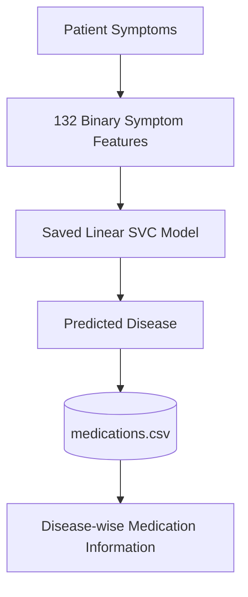
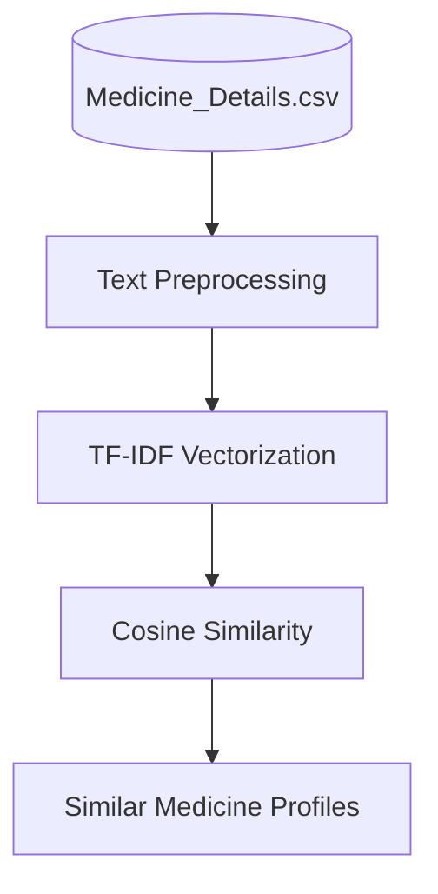

<div align="center">

# 🩺 MediAI

### Personalized Healthcare & Medicine Recommendation System

*Symptom-based disease prediction, disease-wise medication information, and content-based medicine similarity, delivered through an interactive Streamlit dashboard.*


</div>

> [!WARNING]
> **Educational prototype only.** MediAI does **not** provide medical diagnosis, prescribe medication, or replace advice from a qualified healthcare professional. See the [Disclaimer](#-disclaimer).

---

## 📑 Table of Contents

- [Overview](#-overview)
- [Key Features](#-key-features)
- [Demo](#-demo)
- [System Architecture](#-system-architecture)
- [Datasets](#-datasets)
- [Machine Learning](#-machine-learning)
- [Dashboard Pages](#-dashboard-pages)
- [Tech Stack](#-tech-stack)
- [Project Structure](#-project-structure)
- [Getting Started](#-getting-started)
- [Development Notebooks](#-development-notebooks)
- [Limitations](#-limitations)
- [Future Work](#-future-work)
- [Contributing](#-contributing)
- [License](#-license)
- [Disclaimer](#-disclaimer)

---

## 📖 Overview

**MediAI** is a machine learning application that brings together three components in one Streamlit dashboard:

1. **Disease prediction** from 132 binary symptom features using a saved Linear SVC model.
2. **Disease-wise medication information** retrieved from a provided medication dataset.
3. **Content-based medicine similarity** using TF-IDF and cosine similarity over 11,825 medicine records.

The project demonstrates the full workflow from data inspection and preprocessing, through model training and evaluation, to deployment as an interactive web application, while documenting data-quality issues and limitations transparently.

---

## ✨ Key Features

| Feature | Description |
|---|---|
| 🔍 **Symptom-based prediction** | Searchable selection across the 132 symptom features used by the trained model |
| 📈 **Confidence reporting** | Predicted disease with model confidence and top model probabilities |
| 💊 **Medication information** | Disease-wise medication details from `medications.csv` |
| 🧬 **Medicine similarity** | Top-N textually similar medicine profiles with similarity scores |
| 🧾 **Patient profile summary** | Profile fields captured and summarized alongside results |
| 📊 **Project overview page** | Architecture, dataset roles, data-quality observations, and limitations |
| ⚖️ **Responsible design** | Disclaimers and limitations surfaced throughout the application |

---

## 🎬 Demo

<!-- Replace the placeholders below with real screenshots or a GIF -->

| Diagnosis | Medicine Similarity |
|---|---|
|  |  |

> 🌐 **Live app:** `<ADD_DEPLOYMENT_URL_HERE>`

---

## 🧠 System Architecture

### Disease Prediction Pipeline



### Medicine Similarity Pipeline



---

## 📊 Datasets

The project uses four datasets, each with a distinct and separate role.

| Dataset | Purpose | Records |
|---|---|---:|
| `Training.csv` | Disease prediction from symptoms | 4,920 |
| `medications.csv` | Disease-wise medication information | 41 |
| `Cleaned_Dataset.csv` | Patient-profile / risk-analysis support | 349 |
| `Medicine_Details.csv` | Medicine-level text similarity | 11,825 |

<details>
<summary><b>Dataset details</b></summary>

### `Training.csv`
- 4,920 records, 132 binary symptom features (`0` / `1`)
- Target column: `prognosis` (41 disease classes)
- The saved model uses these same 132 features

### `medications.csv`
- Disease-wise medication information, used after prediction
- Contains **no** patient-level outcomes or dosage information, so the application does not learn or prescribe an optimal medication for an individual

### `Cleaned_Dataset.csv`
- Fields include age, gender, blood pressure, cholesterol level, disease, risk level, and an outcome variable
- Used only as supporting patient-profile / risk-analysis data
- **Intentionally not merged** with `Training.csv`, because the records do not represent the same patient-level observations

### `Medicine_Details.csv`
- Fields include medicine name, composition, uses, side effects, manufacturer, review percentages, and image URL
- Similarity uses only: **Medicine Name, Composition, Uses, Side effects**
- Review percentages are **not** used to judge effectiveness or rank medicines

</details>

---

## 🤖 Machine Learning

### Disease Prediction

| Item | Value |
|---|---|
| Algorithm | Linear Support Vector Classifier (Linear SVC) |
| Input | 132 binary symptom features |
| Output | 1 of 41 disease classes |
| Model artifact | `models/best_model.pkl` |
| Label decoder | `models/disease_encoder.pkl` (`LabelEncoder`) |
| Persistence | Joblib |

### Model Evaluation

On the provided dataset and split:

- **Test accuracy:** 100%
- **Precision / Recall / F1:** 1.00 across evaluated classes

> [!IMPORTANT]
> These results are **not** real-world diagnostic accuracy. `Training.csv` has 4,920 rows but only **304 unique rows** after removing exact duplicates. Identical records can therefore appear in both the training and test splits, which inflates the measured performance. Treat the figures as performance on this dataset and split only.

### Medicine Similarity

Content-based filtering over a combined text profile:

```text
Medicine Name + Composition + Uses + Side effects
        ↓  TF-IDF
Numerical vectors
        ↓  Cosine similarity
Ranked similar medicine profiles
```

A higher score indicates greater **textual** similarity. It does **not** imply clinical equivalence, equal effectiveness, equal safety, interchangeability, or suitability for a particular patient.

---

## 🖥️ Dashboard Pages

| Page | What it provides |
|---|---|
| 🏠 **Diagnosis** | Patient profile fields, searchable symptom selection (132 features), selected-symptom counter, disease prediction, model confidence, top model probabilities, profile summary, disease-wise medication information, medical disclaimer |
| 💊 **Medicine Similarity** | Medicine selection, configurable number of results, similarity scores, composition, uses, and side effects |
| 📊 **Project Overview** | Architecture, dataset roles, class/feature/record counts, ML components, data-quality observations, limitations |
| ℹ️ **About** | Objectives, technologies, educational purpose, and limitations |

---

## 🛠️ Tech Stack

| Category | Tools |
|---|---|
| Language | Python |
| Data analysis | Pandas, NumPy |
| Machine learning | Scikit-learn (Linear SVC, LabelEncoder) |
| Text similarity | TF-IDF Vectorizer, Cosine Similarity |
| Model persistence | Joblib |
| Dashboard | Streamlit, custom CSS |
| Development | Jupyter Notebook, VS Code, Git, GitHub |

---

## 📁 Project Structure

```text
personalized-healthcare-recommendation-system/
│
├── data/
│   ├── Training.csv
│   ├── Cleaned_Dataset.csv
│   ├── medications.csv
│   └── Medicine_Details.csv
│
├── models/
│   ├── best_model.pkl
│   └── disease_encoder.pkl
│
├── notebook/
│   ├── 01_Data_Inspection.ipynb
│   ├── 02_Disease_Prediction.ipynb
│   ├── 03_Medicine_Recommendation.ipynb
│   ├── 04_Final_Evaluation.ipynb
│   └── 05_Medicine_Similarity.ipynb
│
├── app.py
├── requirements.txt
├── README.md
└── .gitignore
```

---

## 🚀 Getting Started

### Prerequisites

- Python 3.9 or higher
- `pip`
- Git

### Installation

```bash
# 1. Clone the repository
git clone <YOUR_GITHUB_REPOSITORY_URL>
cd personalized-healthcare-recommendation-system

# 2. Create a virtual environment
python -m venv .venv

# 3. Activate it
# Windows
.venv\Scripts\activate
# macOS / Linux
source .venv/bin/activate

# 4. Install dependencies
pip install -r requirements.txt
```

### Run the Application

```bash
python -m streamlit run app.py
```

The app opens in your browser, by default at `http://localhost:8501`.

### Troubleshooting

| Problem | Fix |
|---|---|
| `streamlit` command not found | Use `python -m streamlit run app.py` with the virtual environment activated |
| Model file not found | Confirm `models/best_model.pkl` and `models/disease_encoder.pkl` exist |
| Dataset file not found | Confirm all four CSV files are inside `data/` |
| Version mismatch when loading the model | Install the scikit-learn version pinned in `requirements.txt` |

---

## 📓 Development Notebooks

| Notebook | Purpose |
|---|---|
| `01_Data_Inspection` | Dataset structure, data types, missing values, duplicates, symptom features, disease distribution |
| `02_Disease_Prediction` | Model training and evaluation on `Training.csv` |
| `03_Medicine_Recommendation` | Connecting predictions to disease-wise medication data |
| `04_Final_Evaluation` | End-to-end evaluation of prediction and medication pipeline |
| `05_Medicine_Similarity` | TF-IDF and cosine-similarity medicine matching |

The notebooks are development and analysis artifacts. The user-facing interface is `app.py`.

---

## ⚠️ Limitations

**Dataset**
- `Training.csv` contains many duplicate records, so the 100% accuracy is likely inflated by train/test overlap.
- Performance applies only to the provided dataset and evaluation setup.

**Medication**
- `medications.csv` is disease-level only, with no patient-level outcomes.
- The system cannot learn an optimal medication for an individual and gives no dosage instructions.

**Medicine similarity**
- Similarity is purely textual and does not establish clinical equivalence, safety, or effectiveness.
- Similar medicines must not be treated as interchangeable.

**Dataset separation**
- `Cleaned_Dataset.csv` and `Training.csv` differ in structure and purpose, so their records are deliberately not merged.

---

## 🗺️ Future Work

- [ ] Deduplicate `Training.csv` and re-evaluate with a leakage-free split (e.g., stratified k-fold on unique rows)
- [ ] Compare additional models and report calibrated probabilities
- [ ] Add a larger, real-world symptom dataset for more realistic evaluation
- [ ] Add unit tests and CI (GitHub Actions)
- [ ] Containerize with Docker for reproducible deployment
- [ ] Improve similarity with embeddings alongside TF-IDF

---

## 🤝 Contributing

Contributions, issues, and suggestions are welcome.

1. Fork the repository
2. Create a feature branch: `git checkout -b feature/your-feature`
3. Commit your changes: `git commit -m "Add your feature"`
4. Push the branch: `git push origin feature/your-feature`
5. Open a Pull Request

---

## 📄 License

Distributed under the MIT License. See [`LICENSE`](LICENSE) for details.
<!-- Replace with your chosen license and add a LICENSE file. -->

---

## 🔐 Disclaimer

> **This system is intended for educational and informational purposes only.**
>
> - It does not provide medical diagnosis, prescribe medication, or replace advice from a qualified healthcare professional.
> - Disease predictions are based solely on the provided machine learning dataset.
> - Medication information is retrieved from the provided disease-wise dataset.
> - Medicine similarity represents textual similarity and does not imply clinical equivalence or interchangeability.
>
> Always consult a licensed healthcare professional for medical concerns.

---

<div align="center">

**MediAI — Personalized Healthcare & Medicine Recommendation System**

Built with Python • Pandas • NumPy • Scikit-learn • Joblib • TF-IDF • Cosine Similarity • Streamlit

</div>
